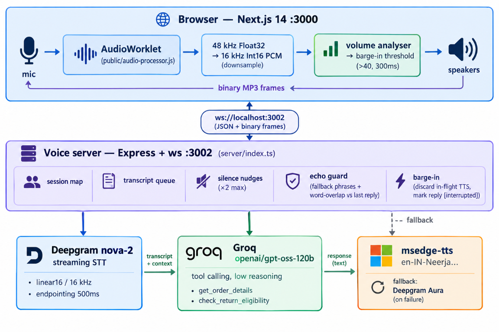

# AURA — Voice Support Agent for Aura Skincare

**Aria** is a real-time AI phone agent: you talk to it in English or Hinglish, it
looks up orders, checks return/cancellation policy through tools, and talks back
with a natural Indian voice — all inside the browser, with no telephony
infrastructure and no TTS/STT bill.

```
 you speak ──► 16 kHz PCM ──► STT ──► LLM + tools ──► TTS ──► you hear Aria
                 (browser)   (Deepgram)  (Groq)        (Edge-TTS)
```

---

## Demo scope

Three deterministic demo orders power the whole flow:

| Order     | Status          | Customer        | Behaviour                                            |
|-----------|-----------------|-----------------|------------------------------------------------------|
| `ORD-101` | Out for Delivery | Priya Sharma   | Trackable (`BlueDart BD-982103`), not cancellable     |
| `ORD-102` | Delivered 14d ago | Rahul Verma   | Outside the 7-day return window → return refused      |
| `ORD-103` | Processing       | Ananya Patel   | The one order that **can** be cancelled               |

Everything else (`ORD-999`, gibberish, wrong digits) resolves to a polite
"please double-check that ID" — never a hallucinated order.

---

## Architecture

<p align="center">
  
</p>

**Call lifecycle:** `start_call` → greeting → streamed customer audio → final
transcript → `thinking` → tool round-trips → `speaking` → TTS audio frame →
`listening` → silence > 8 s → nudge (max 2) → `end_call` → `call_ended` with a
structured summary.

---

## Tech stack

| Layer | Choice | Detail |
|---|---|---|
| Frontend | Next.js 14 · React 18 · Tailwind | Single-page call UI, live transcript, summary card |
| Realtime | Browser `WebSocket` ↔ `ws` | One socket, JSON control messages + raw binary audio |
| Audio capture | **AudioWorklet** | `public/audio-processor.js`, 48 kHz → 16 kHz PCM16, transferable buffers |
| STT | **Deepgram** `nova-2` | `linear16 @ 16 kHz`, interim results, `endpointing: 500ms`, `speech_final` gating |
| LLM | **Groq** `openai/gpt-oss-120b` | OpenAI SDK on Groq baseURL, `reasoning_effort: low`, bounded 3-round tool loop |
| Tools | 2 deterministic functions | `get_order_details`, `check_return_eligibility` (policy enforced in code, not prose) |
| TTS | **msedge-tts** `en-IN-NeerjaNeural` | 24 kHz/48 kbps MP3, Deepgram Aura-asteria as fallback, 7 s timeout per engine |
| Summary | Groq JSON mode | `json_object` response format, measured duration always wins |
| Server | Express + TypeScript | `server/` workspace, `tsc` → `dist/`, `ts-node-dev` in dev |
| Tests | Vitest | 19 tests across 6 files (structural + live integration) |

### Why this stack?

> **Groq for zero-latency LLM + Deepgram for streaming STT + Edge-TTS for a
> native Indian voice at $0 cost.**

- **Groq** — LPU inference puts the model response in the low hundreds of
  milliseconds, which is what makes a *spoken* turn feel conversational instead
  of lopsided. `reasoning_effort: low` keeps gpt-oss on the fast path.
- **Deepgram** — true streaming (`interim_results` + `speech_final`) is what
  makes endpointing and interruption possible at all; you cannot build barge-in
  on a batch transcription API.
- **Edge-TTS** — `en-IN-NeerjaNeural` gives a believable Indian-English voice
  with **zero** per-character cost, and the whole demo's audio bill is $0.
  Deepgram Aura sits behind it as the reliability fallback.

The entire realtime pipeline therefore costs only the LLM tokens.

---

## Quick start

```bash
# 1. install (root + server workspace)
npm install
npm --prefix server install

# 2. configure secrets
cp .env.example .env
#    GROQ_API_KEY=...      DEEPGRAM_API_KEY=...
#    NEXT_PUBLIC_WS_URL=ws://localhost:3002
#    PORT=3002

# 3. run everything (server :3002 + frontend :3000)
npm start

# 4. open the UI and press Call
#    http://localhost:3000
```

Production-style run:

```bash
npm --prefix server run build   # tsc -> server/dist
node server/dist/index.js       # voice server
npm run build && npm start      # or next start for the frontend
```

> `server/.env` is read by the voice server; the root `.env` is read by Next.
> Both are git-ignored — only `.env.example` (placeholders) is committed.

---

## Scripts

| Command | What it does |
|---|---|
| `npm start` | `concurrently` → voice server (`ts-node-dev --respawn`) + `next dev` |
| `npm run dev` | Next dev only |
| `npm run server` / `npm run frontend` | Run either half alone |
| `npm test` | Full Vitest suite (structural always; integration runs when keys are present) |
| `npm run test:watch` | Watch mode |
| `npm run test:report` | V8 coverage summary |
| `npm --prefix server run build` | Type-check + emit `server/dist` |

---

## WebSocket protocol

Client → server

| Type | Payload | Notes |
|---|---|---|
| `start_call` | `{ orderId }` | Invalid ID → agent text reply, call stays open; duplicate is ignored (no STT leak) |
| `end_call` | — | Server replies `call_ended` before the socket closes (client waits up to 5 s) |
| `barge_in` | — | Marks the in-flight reply interrupted, current agent line gets `[interrupted]` |
| *binary frame* | raw PCM16 | Routed to **this connection's** session only, never JSON-parsed |

Server → client

| Type | Payload | Notes |
|---|---|---|
| `state` | `listening \| thinking \| speaking` | UI + audio-gating driver |
| `transcript` | `{ speaker, text, isInterim?, timestamp }` | Interim rows are replaced in place |
| `nudge` | `{ text }` | Silence > 8 s, capped at 2 per call |
| `call_ended` | `{ transcript, summary }` | Summary = intent, order, sentiment, duration, follow-up |
| *binary frame* | MP3 audio | Played sequentially; volume monitoring runs during playback |

---

## Reliability hardenings

What the pipeline does when things go wrong:

- **STT** — auto-reconnect with exponential backoff (5 attempts) + audio
  buffered while the socket is down, so short utterances survive a blip.
- **TTS** — 7 s timeout per engine, Edge → Deepgram Aura fallback, then the
  reply still ships as text (`state: listening` restored) instead of hanging.
- **LLM** — bounded 3-round tool loop (never leaves an unanswered `tool_call`
  in history), 60-message context trim on user-turn boundaries, Unicode
  normalization (`ORD‑101` → `ORD-101`), a canned fallback reply on failure.
- **Session** — responses serialized per session (no history races), unique
  session IDs, duplicate `start_call` rejected, re-entrancy guard on `endCall`.
- **Echo** — fallback-phrase filter + word-overlap check against the last agent
  line (the nudge text is registered as an agent line, so its own echo is
  filtered too).
- **Summary** — measured `call_duration_seconds` is forced over whatever the
  model returns; empty transcripts return the deterministic fallback without an
  API call.

---

## Testing

```bash
npm test
```

```text
Test Files  6 passed (6)
Tests       19 passed (19)
```

| Suite | Kind | Guards |
|---|---|---|
| `tools.test.ts` | unit | The 3 demo orders, not-found safety, return/cancel policy matrix |
| `llm-guardrails.test.ts` | structural | Prompt stays in-domain, 7-day / `Processing` policy text |
| `tool-calling.test.ts` | structural + integration | Tool schemas, tool round-trip, live order lookup |
| `summary.test.ts` | structural + integration | All 9 summary fields, fallback strings, live JSON shape |
| `websocket-protocol.test.ts` | structural | Lifecycle messages, binary handling, barge-in marker |
| `requirements-checklist.test.ts` | unit | Suite shape, no secrets in tests, assertion helpers |

Integration tests load `server/.env` automatically and skip when no key is set.

---

## Project layout

```
AURA/
├─ app/                    # Next.js page + call UI
├─ hooks/
│  ├─ useVoiceAgent.ts     # socket lifecycle, barge-in, state machine
│  ├─ useAudioRecorder.ts  # mic → AudioWorklet, volume analyser
│  └─ useAudioPlayer.ts    # sequential MP3 playback queue
├─ public/audio-processor.js   # AudioWorklet: 48k→16k PCM16 downsample
├─ server/
│  ├─ index.ts             # Express + ws, sessions, echo guard, nudges
│  ├─ services/llm.ts      # Groq client, tools, summary
│  ├─ services/stt.ts      # Deepgram streaming + reconnect
│  ├─ services/tts.ts      # Edge-TTS + Deepgram fallback
│  ├─ data/orders.ts       # demo orders + spoken ID normalisation
│  └─ prompts/system-prompt.ts  # Aria's policy + guardrails
├─ tests/                  # Vitest suites
└─ vitest.config.ts
```

---

## The interview questions

### Why this stack?

**Groq for zero-latency LLM + Deepgram for streaming STT + Edge-TTS for a
native Indian voice at $0 cost.** A voice loop is unforgiving: any layer that
takes a second turns a conversation into a queue. Groq removes the LLM from the
critical path, Deepgram's streaming gives us interim transcripts and
`speech_final` (the raw material barge-in needs), and Edge-TTS's
`en-IN-NeerjaNeural` sounds local without charging per character. The demo's
whole audio bill is $0 — only LLM tokens cost anything.

### Most difficult part?

**Audio downsampling to 16 kHz PCM and volume-threshold barge-in handling.**
Browsers hand you 48 kHz Float32 from the AudioContext; Deepgram wants 16 kHz
Int16. Doing that off the main thread in an AudioWorklet — with buffered
decimation, correct int16 clamping, and transferable buffers so you never copy
audio through the JS heap — is fiddly. Then barge-in: the threshold has to be
high enough not to fire on TTS spill, sustained long enough (~300 ms) not to
fire on a cough, and once it fires you must cancel playback, tell the server to
discard TTS that is already generating, and resume the mic stream without a
gap — or you eat your own audio as an echo.

### What would you improve with 1 more week?

**Chunk-level streaming TTS and a VAD model for sub-100 ms interrupts.** Right
now the server synthesises the *entire* reply before sending the first byte, so
time-to-first-audio is bounded by the longest sentence. Streaming TTS in
chunks (sentence-by-sentence, or Deepgram's streaming speak) would start audio
out while the LLM is still writing. On top of that, replacing the volume
threshold with a proper VAD (Silero, or browser-native `AudioProcessing` +
energy + spectral gating) would cut false interrupts and let me detect
intentional silence — bringing interrupt latency under 100 ms.

### How do you scale to 1,000 calls/day?

- **Redis session management** — sessions move off the in-process `Map`, so the
  voice server becomes stateless and horizontally scalable behind a load
  balancer; WS affinity via a session key, transcripts/summaries shared.
- **TTS response caching** — greetings, nudges, policy answers and common
  order-status lines are identical across calls; hash the text + voice and
  serve bytes from Redis instead of re-synthesising.
- **BullMQ job queues** — summaries, transcript persistence and any
  post-call analytics move off the request path into workers, with retries and
  backpressure so a Groq/Deepgram hiccup can't stall a live call.

1,000 calls/day ≈ 7 concurrent calls at peak — comfortably inside a single
node once sessions are externalised; the queues are what keep p95 latency flat
as that grows.

---

## Environment variables

| Variable | Where | Purpose |
|---|---|---|
| `GROQ_API_KEY` | `server/.env` | LLM + summary |
| `DEEPGRAM_API_KEY` | `server/.env` | STT and TTS fallback |
| `PORT` | `server/.env` | Voice server port (default `3002`) |
| `NEXT_PUBLIC_WS_URL` | root `.env` | Browser WebSocket target (default `ws://localhost:3002`) |

Rotate any key that has ever been pasted into a chat, issue, or log.

---

## License

Private / demo project.
